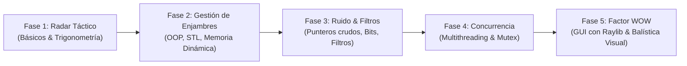

# Motor de Sistema C-RAM / CIWS (Interceptor Antiaéreo Autónomo)

> **Inspiración:** Phalanx CIWS, Iron Dome (Cúpula de Hierro).  
> **Objetivo:** Detección de amenazas (enjambres de drones / misiles), cálculo balístico de trayectorias e intercepción autónoma en tiempo real.

---

## 🎯 Hoja de Ruta por Fases



---

### Fase 1: El Radar Táctico (Básicos y Matemáticas)
- **Conceptos Clave de C++:** Variables, tipos primitivos, bucles (`while`, `for`), funciones, `<cmath>`.
- **Lógica Física / Matemática:**
  - Sistema de coordenadas cartesiano 2D con base/origen en $(0,0)$.
  - Cálculo de distancia euclidiana / hipotenusa: $d = \sqrt{x^2 + y^2}$.
  - Ángulo de azimut / intercepción con `std::atan2(y, x)`. Conversión radianes/grados.
- **Entregable en Consola:**
  ```text
  [RADAR ACTIVADO]
  ¡Alerta! Dron detectado en (x: 3340m, y: 3010m).
  Distancia a la base: 4496.7m | Ángulo de intercepción: 42.0°
  ```

---

### Fase 2: Gestión de Enjambres (OOP y Memoria Dinámica)
- **Conceptos Clave de C++:** Clases y structs, encapsulamiento, punteros inteligentes (`std::unique_ptr`), contenedores STL (`std::vector`, `std::algorithm`).
- **Lógica de Defensa:**
  - Clase `Threat` / `Amenaza` (ID, posición $(x, y)$, velocidad $(v_x, v_y)$, tipo de amenaza).
  - Algoritmo de **Triaje y Priorización**:
    - Cálculo de **TTC** (*Time To Collision* / Tiempo hasta el impacto).
    - Descarte de amenazas no críticas (vector de velocidad apunta fuera del radio de protección de la base).
    - Ordenación en tiempo real por nivel de urgencia (`std::sort` con lambda personalizada).

---

### Fase 3: Ruido Electrónico y Filtros (Punteros y Bits)
- **Conceptos Clave de C++:** Arrays crudos, aritmética de punteros, operaciones a nivel de bit (`&`, `|`, `^`, `>>`, `<<`), máscaras binarias.
- **Lógica de Defensa:**
  - Simulación de stream binario de telemetría de radar con ruido/interferencias (*Electronic Jamming*).
  - Decodificación de paquetes binarios mediante bitmasks para aislar firmas térmicas y telemetría válida.
  - Implementación de un **Filtro de Media Móvil (Moving Average)** o **Filtro de Kalman 1D/2D** para suavizar lecturas erráticas y evitar oscilaciones en la torreta.

---

### Fase 4: La Arquitectura Multihilo (El Cerebro en Tiempo Real)
- **Conceptos Clave de C++:** Concurrencia moderna (`std::thread`, `std::mutex`, `std::lock_guard`, `std::atomic`, `std::condition_variable`).
- **División de Hilos:**
  1. **Hilo Sensor / Radar:** Genera y actualiza telemetría de objetivos a alta frecuencia sin bloquear el sistema.
  2. **Hilo Balístico / Computador de Tiro:** Consume el estado compartido protegido por mutex, predice posición futura en $T + \Delta t$, calcula cinemática inversa y solución de disparo.
  3. **Hilo Actuador / Torreta:** Maneja la orientación (slew rate / velocidad angular de giro) y cadencia de fuego del cañón.

---

### Fase 5: El Factor "WOW" (Visualización con Raylib)
- **Conceptos Clave de C++:** Gestión de dependencias y build system con **CMake**, integración de librerías en C/C++.
- **Librería Gráfica:** [Raylib](https://www.raylib.com/) (ligera, ideal para visualización táctica 2D/3D).
- **Interfaz Gráfica Táctica:**
  - Barrido circular de radar analógico tipo PPI (*Plan Position Indicator*).
  - Enjambre de objetivos renderizados con vectores de predicción de trayectoria.
  - Trazas de proyectiles interceptores saliendo desde la torreta central.
  - Detección visual y lógica de colisión en tiempo real a 60 FPS.

---

## 🛠️ Herramientas y Entorno Recomendado
- **Compilador:** GCC / Clang (MinGW-w64 en Windows) o MSVC.
- **Estándar C++:** C++17 o C++20.
- **Build System:** CMake.
- **Visualización:** Raylib.
