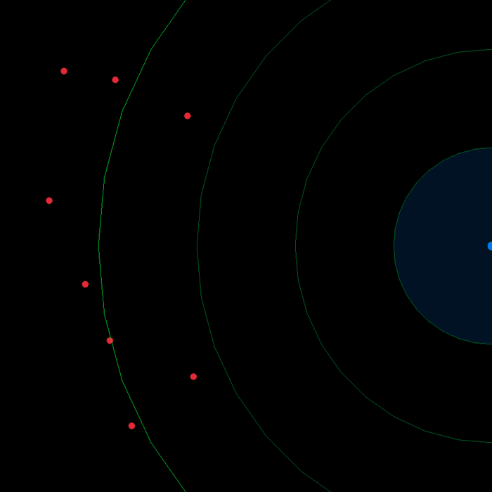

# Autonomous C-RAM / CIWS Defense Simulation (C++20 & Raylib)

[](https://en.wikipedia.org/wiki/C%2B%2B20)
[](https://cmake.org/)
[](https://www.raylib.com/)
[](https://opensource.org/licenses/MIT)

Real-time autonomous air-defense system simulation inspired by Phalanx CIWS and Iron Dome architectures. It models radar acquisition, closed-loop actuator dynamics, trajectory lead-pursuit prediction, and projectile-threat proximity interception over a 2D planar theater.

---

## Tactical Radar Display



---

## Key Features

- **Real-Time Ballistic Interception (Lead Pursuit):** Solves 2nd-degree intercept kinematics in real-time, computing future impact coordinates and turret lead azimuth rather than chasing stale sensor coordinates.
- **Modular Multi-Tier Architecture:** Clean separation of concerns across physical domains:
  - `core/`: Custom math primitives (`Vec2` with operator overloads, dot products, polar projections) and system constants.
  - `entities/`: Base kinematics model (`Entity`), hostile drones/missiles (`Threat`), and interceptors (`Bullet`).
  - `systems/`: Sensor layer (`Radar`), fire-control computer (`FireControl`), physical actuators (`Turret`), and combat orchestrator (`World`).
  - `graphics/`: Decoupled 2D tactical HUD powered by Raylib (`Renderer`).
- **Modern C++20 Practices:** Pure value semantics, constexpr configuration tables, lambdas, custom STL vector memory management (`reserve()`), and standard sanitization via `std::erase_if`.
- **Zero-Config Build:** Automatic dependency resolution via CMake's `FetchContent`—no manual installation or external library linking needed.
- **Continuous Tracking & Dynamic Slew Limits:** Actuators respect real-world angular velocity limits (`maxTurnRate`), shortest-path wrap-around rotation logic, and firing interlocks.

---

## How to Build & Run

### Prerequisites
- C++20 compliant compiler (GCC 13+, Clang 16+, or MSVC 2022)
- CMake 3.16+
- Git

### Build Instructions

```bash
# 1. Clone repository
git clone https://github.com/alvrooperez/C-RAM-SYSTEM.git
cd C-RAM-SYSTEM

# 2. Configure build system (automatically fetches Raylib 5.0)
cmake -B build

# 3. Build executable
cmake --build build

# 4. Run simulation
./build/SistemaCram
```

On Windows PowerShell:
```powershell
.\build\SistemaCram.exe
# Or use the included helper script:
.\run.bat
```

---

## Controls

- **ESC / Q**: Close tactical radar display and view final mission report.

---

## License
Distributed under the MIT License. See `LICENSE` for details.
